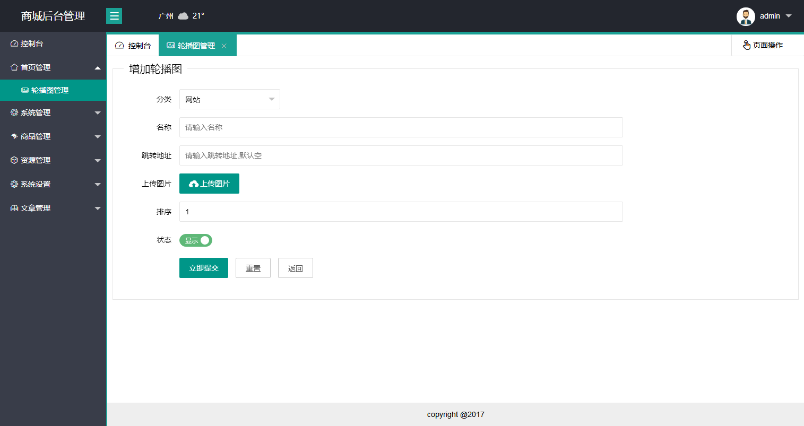
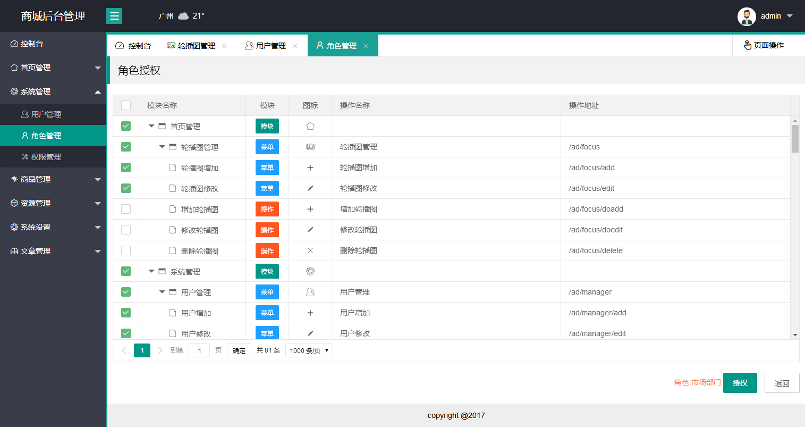
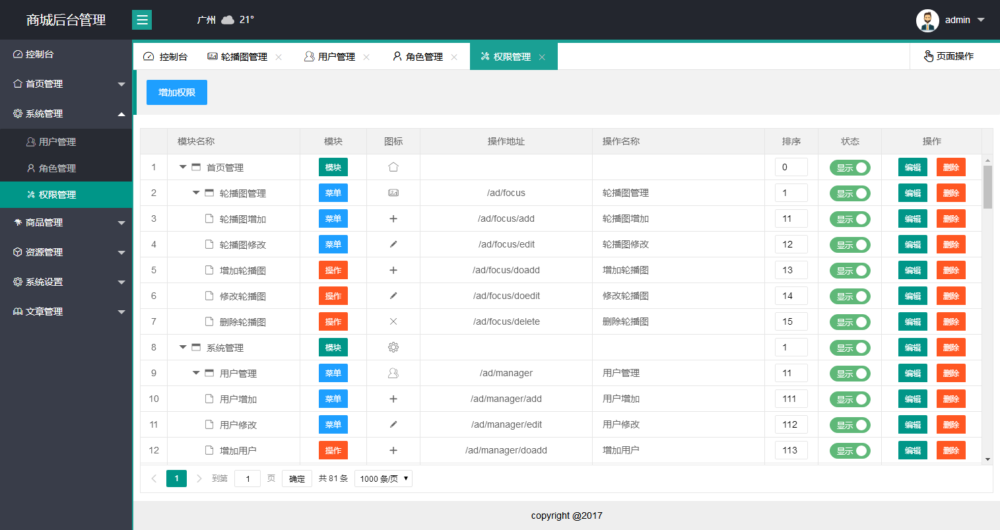
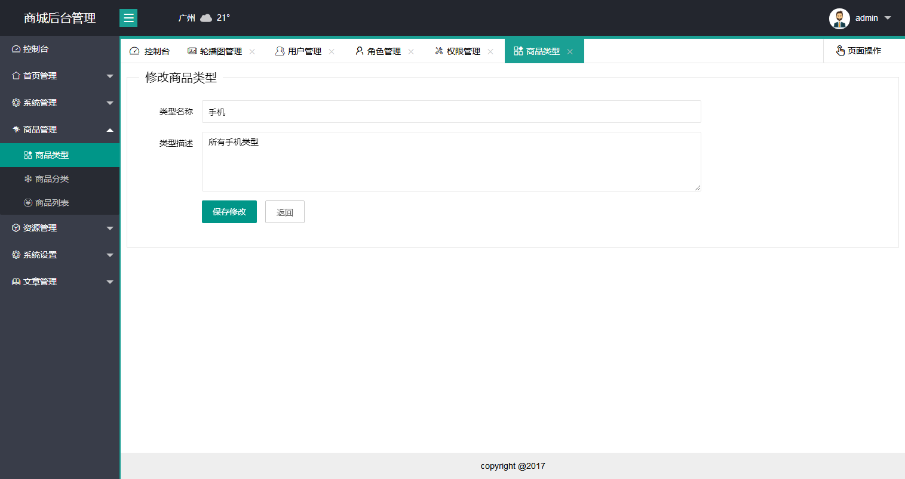
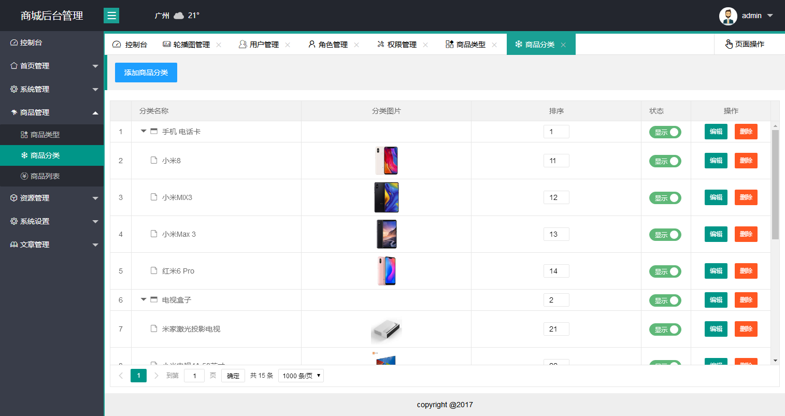
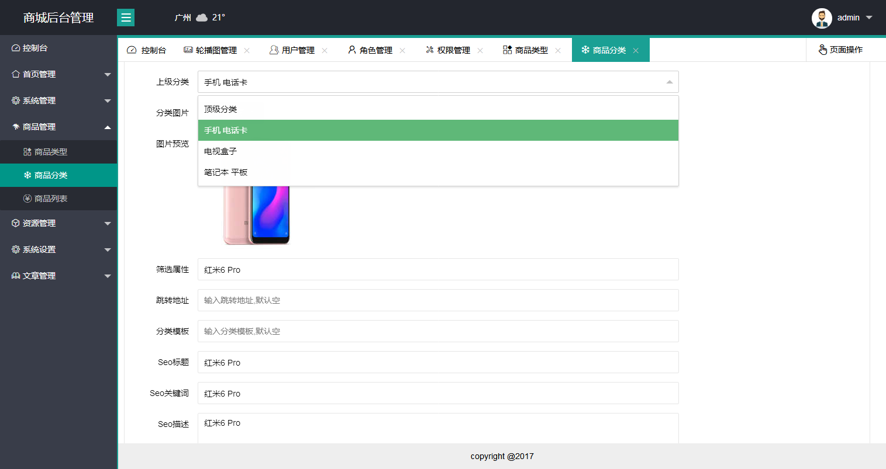
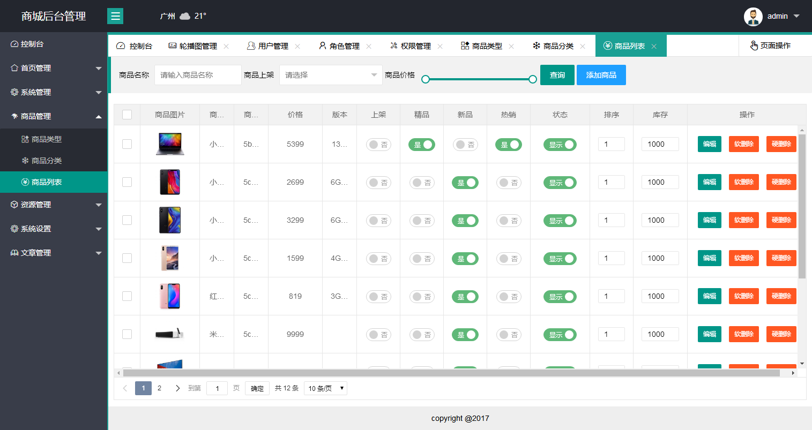
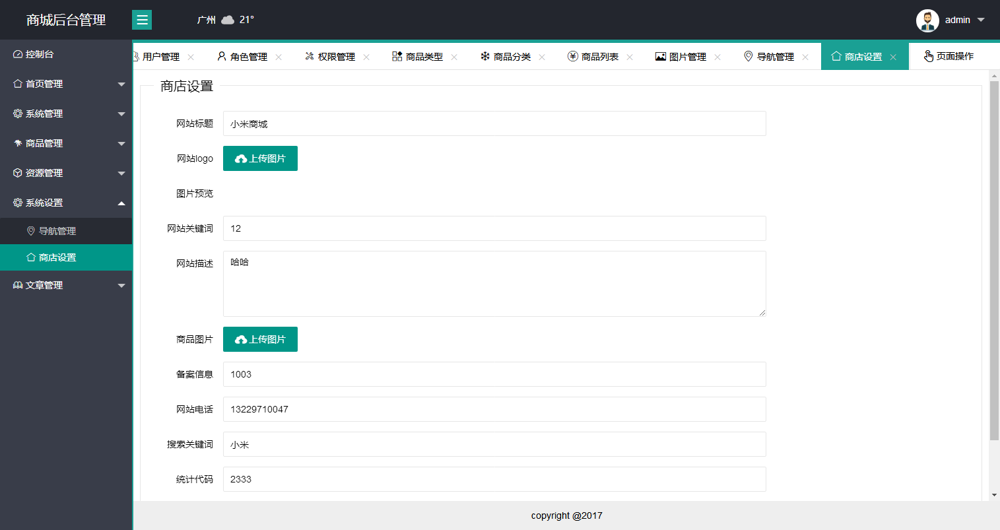

# eggcms
在线预览地址 ：http://www.suwh.club:7001
egg开发RBAC商城权限管理，还在开发中。




















## 开始

<!-- add docs here for user -->

启动项目前先导入数据库
- 导入数据库
    - 安装mongodb 
    - 开启mongodb
    - 数据文件夹在doc文件夹内
    - mongodb导入：mongorestore -h dbhost -d dbname path 
    - dbhost是mongodb的IP，dbname是数据库的名字，path是doc里的数据库文件夹
    - 如下：
    - mongorestore -h 127.0.0.1 -d eggcms ./eggcms
- 修改mongodb链接
    - 在config文件夹里的config.default.js文件，修改对应你的mongodb地址
    - 有用户名的话使用用户名，没的话就直链

### 测试环境

```bash
$ npm i
$ npm run dev
$ open http://localhost:7001/ad/login
```
测试账号 admin 密码 123456

### 生产环境

```bash
$ npm start
$ npm stop
```
